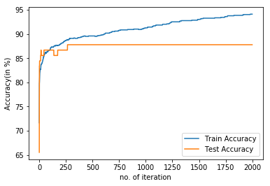

# <u> Binary classification using Logistic Regression model</u>

### Aim
It basically classifies whether a given image is of Sunflower or of rose

### Code Requirements
You can install Conda for python which resolves all the dependencies for machine learning.

### Description
Deep learning (also known as deep structured learning or hierarchical learning) is part of a broader family of machine learning methods based on learning data representations, as opposed to task-specific algorithms. Learning can be supervised, semi-supervised or unsupervised.

Deep learning models are loosely related to information processing and communication patterns in a biological nervous system, such as neural coding that attempts to define a relationship between various stimuli and associated neuronal responses in the brain.

The below code is written from scratch using pytorch for dataloading and GPU acceleration. Logistic regression was used for this training.

```python
import matplotlib.pyplot as plt
import torch
from torchvision import datasets, transforms
import helper
from time import sleep
import numpy as np
from random import randint
```

## Load Data

- Created a batch of 1200 for training set and 90 for test set
- 0 means Rose
- 1 means Sunflower

Dataset can be found here: https://drive.google.com/drive/folders/1pBfZrU8m_29tTxZ0DwKFKhOUPUfvavoY?usp=sharing


```python
data_dir = '/home/rohit/Desktop/flowers'
 # batch size
# Define transforms for the training data and testing data
train_transforms = transforms.Compose([transforms.RandomRotation(10),
                                       transforms.Resize((255, 255)),
                                       transforms.RandomHorizontalFlip(),
                                       transforms.ToTensor(),
                                      ])

test_transforms = transforms.Compose([transforms.Resize((255, 255)),
                                     transforms.ToTensor()])


# Pass transforms in here, then run the next cell to see how the transforms look
train_data = datasets.ImageFolder(data_dir + '/train', transform=train_transforms)
test_data = datasets.ImageFolder(data_dir + '/test', transform=test_transforms)
test_data = datasets.ImageFolder(data_dir + '/test', transform=test_transforms)
custom = datasets.ImageFolder(data_dir)

trainloader = torch.utils.data.DataLoader(train_data, batch_size=1200, shuffle = True)
testloader = torch.utils.data.DataLoader(test_data, batch_size=90)
```

## Iterate through all images in batch
1. Defined dataload
2. Flatten images
3. Intialized weights and biases to zeros
4. Transferred all tensors to GPU


```python
def dataload(loader,m):    
    data_iter = iter(loader)
    images, labels = next(data_iter)
    print('initial image size = ', images.shape)
    images = images.reshape(m,-1).t() /255
    print('flattened image size = ', images.shape)
    (nx,m) = images.shape # m is no of training exmples 
    return images,labels,nx,m
```


```python
images,labels,nx,m = dataload(trainloader,1200)
X = images.cuda() # (nx x m)
Y = labels.cuda() 
Y = torch.reshape(Y,(1,m)) # (1 x m)
Y = Y.float().cuda()
```

    initial image size =  torch.Size([1200, 3, 255, 255])
    flattened image size =  torch.Size([195075, 1200])


```python
w = torch.zeros((nx,1)).cuda() #weights
b = torch.zeros(1).cuda()#biases
```


```python
images,labels,nx,n = dataload(testloader,90)
X_test = images.cuda() # (nx x m)
Y_test = labels.cuda() 
Y_test = torch.reshape(Y_test,(1,n)) # (1 x m)
Y_test = Y_test.float().cuda()
```

    initial image size =  torch.Size([90, 3, 255, 255])
    flattened image size =  torch.Size([195075, 90])


## Helper functions


$sigmoid( w^T x + b) = \frac{1}{1 + e^{-(w^T x + b)}}$


```python
def sigmoid(x):
    return (1 / (1+torch.exp(-x)))
```

## Forward Propagation:


```python
def parameters(w, b, X, Y):
    A = sigmoid(torch.mm(w.t(), X)+b) # dimension (1 x m)
    cost = -(torch.mm(Y , torch.log(A.t())) + torch.mm((1-Y) , torch.log( (1-A).t() ) )) / m
    dz = A - Y
    db = (torch.sum(dz))  /  m
    dw = torch.mm(X, dz.t())
    
    assert(dw.shape == w.shape)
    
    return cost,dw,db
```

## Predicition 


```python
def predict(w,b,X):
    A = sigmoid(torch.mm(w.t(), X)+b)
    
    Y_prediction = torch.zeros((1,X.shape[1])).cuda()
    for i in range(X.shape[1]):
        
        if A[0,i] > 0.5:
            Y_prediction[0,i] = 1
        else:
            Y_prediction[0,i] = 0
            
    return Y_prediction
```

## Training the model

Given an initial value of weights, biases, iteration and learning rate, the below block of code will try to
optimize the values of weight and biases such that we get a higher training accuracy.


```python
def optimize(w, b, X, X_test, Y, num_iterations, alpha ):
    
    cost_arr = []
    Y_p_train = []
    Y_p_test = []
    for i in range(num_iterations):
        
        cost,dw,db = parameters(w, b, X, Y)
        w = w - alpha * (dw )
        b = b - alpha * db
        
        if num_iterations % 1000 == 0:
            cost_arr.append(cost)
            
            Y_prediction_train = predict(w, b, X)
            t1 = 100 - torch.mean(torch.abs(Y_prediction_train - Y)) * 100
            Y_p_train.append(t1)
            
            Y_prediction_test = predict(w, b, X_test)
            t2 = 100 - torch.mean(torch.abs(Y_prediction_test - Y_test)) * 100
            Y_p_test.append(t2)
            # print("test accuracy: ", t2, "train accuracy: ",t1)
    
    return cost_arr, w, b, Y_p_train, Y_p_test
```

# Calculation of Test and Train Accuracy


```python
cost_arr, w, b, Y_p_train, Y_p_test = optimize(w, b, X, X_test, Y, 2000, 0.01)
plt.ylabel('Accuracy(in %)')
plt.xlabel('no. of iteration')
plt.plot(Y_p_train, label = 'Train Accuracy')
plt.plot(Y_p_test, label ='Test Accuracy')
plt.legend()
```


    <matplotlib.legend.Legend at 0x7fa429526198>





```python
print("Train Accuracy: ", float(Y_p_train[-1]), "\t Test Accuracy: ", float(Y_p_test[-1]))
```

    Train Accuracy:  94.08333587646484 	 Test Accuracy:  87.77777862548828


## Test your own image


```python
x = randint(0, 90)
images, labels = next(iter(testloader))
helper.imshow(images[x], normalize = False)
k = torch.reshape(images[x], (-1,))
k = torch.reshape( k,(195075,1) ).cuda()

if predict(w,b,k) == 1:
    print("I thinks its a Sunflower")
else:
    print("I thinks its a Rose")
```

    I thinks its a Sunflower


